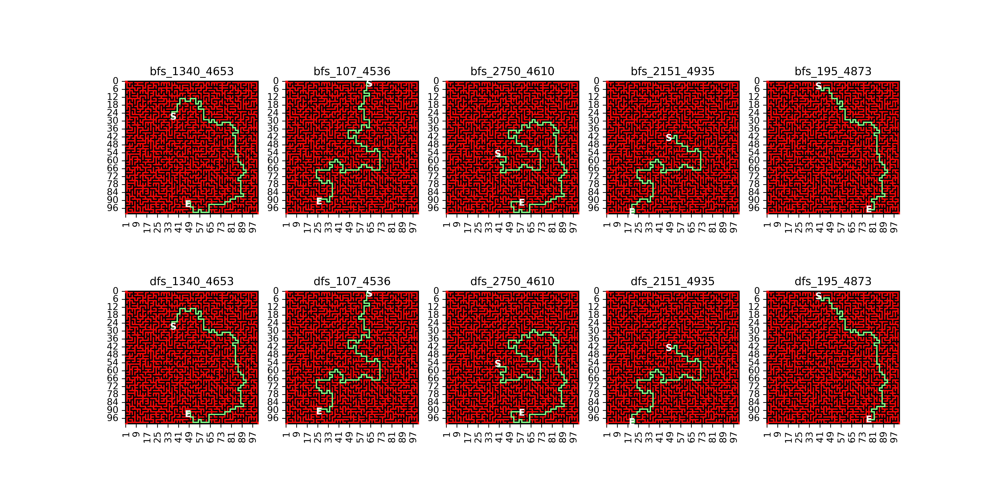

# Maze Path Search

A simple implementation of basic path search algorithms namely:
- Depth-First Search
- Breadth-First Search

The script reads from *maze.xlsx* for the maze. There are two sheets namely:
- maze_20by20
- maze_101by101

which differ on the maze sizes as name suggests. The maze input uses "#" as barrier blocks and "" (empty) cells as path blocks. Example:

| **Row**    | **A** | **B** | **C** | **D** | **E** | **F** | **G** | **H** | **I** |
|:----------:|:-----:|:-----:|:-----:|:-----:|:-----:|:-----:|:-----:|:-----:|:-----:|
| **1**      |       |       |       |       |       |       |       |       |       |
| **2**      |       | #     | #     | #     |       | #     | #     | #     | #     |
| **3**      |       | #     | #     | #     |       | #     |       |       |       |
| **4**      |       |       |       |       | #     | #     | #     | #     | #     |
| **5**      | #     | #     | #     |       |       |       |       |       |       |
| **6**      |       | #     | #     |       | #     |       | #     |       | #     |
| **7**      |       | #     | #     |       | #     |       | #     |       | #     |
| **8**      |       | #     | #     |       | #     |       | #     |       | #     |
| **9**      |       |       |       |       | #     |       | #     |       | #     |
| **10**     | #     | #     | #     |       | #     |       | #     |


## Starting and Ending Nodes
Change the starting and ending nodes via these lines. Currently these are selected at random. The current setup loops over 5 pairs of starting and ending nodes and repeats
for each path search algorithm.


```python
starts = np.random.choice(range(0,3500),5)
ends = np.random.choice(range(4000,5007),5)
```

## Sample Result

Shown below are the results for the maze_101by101 maze which is comprised of 5007 path nodes. The **S** and **E** annotations represents the location of the starting and ending nodes as indicated in each title. Notice that results for DFS and BFS are identical. These may not always be the case. Also take node that the path highlighted here does not necessarily indcate the shortest path between the starting and ending nodes.

Furthermore, the results would also be shown via Excel files where the path taken will be highlighted and with the node numbers
preserved.



## Neighbor Sorting Methods
Another thing to try is to see how would the sorting method for each immediate neighbor to the current node would affect the final path. This could either be done by sorting using the least Manhattan distance between the current node and the end node. Or sort the nodes randomly instead.

```python
if neighbor_sort_method == "manhattan":
    #sort according to least manhattan distance from end node
    neighbors = self.manhattan_sort(end,neighbors,method)
elif neighbor_sort_method == "random":
    #randomly shuffle the values
    np.random.shuffle(neighbors)
elif neighbor_sort_method is None:
    #just pass the neighbors as is
    pass
else:
    raise InvalidSortingMethod(
        f"""Invalid neighbor sorting method ({neighbor_sort_method}). Choose manhattan, random, or None.""")
```
